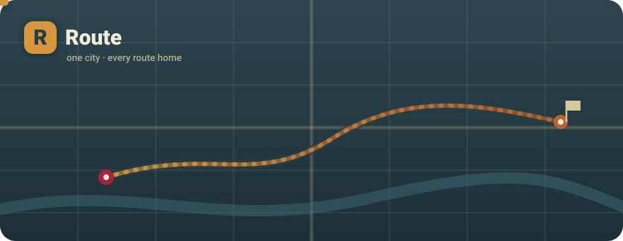
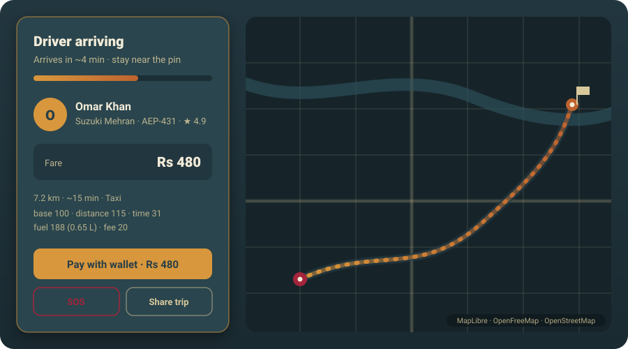
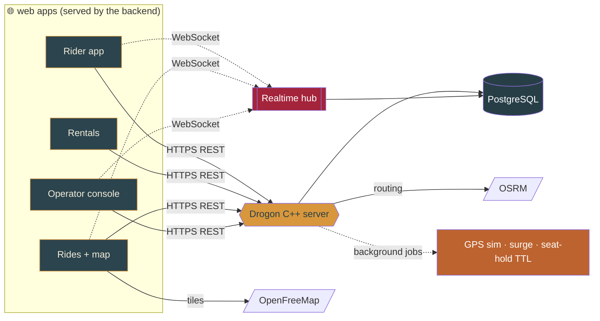

<!-- ════════════════════════════════════════════════════════════════════ -->
<!--                                ROUTE                                  -->
<!-- ════════════════════════════════════════════════════════════════════ -->

<div align="center">

<!-- animated live-map hero — loops on GitHub (SVG + SMIL) -->


<br/>

<!-- animated typing banner (served as an image, so GitHub renders it) -->
<a href="https://github.com/Zero-State-Logic/route">
  
</a>

<p><b>A full metropolitan transportation platform written in C++.</b><br/>
One <a href="https://github.com/drogonframework/drogon">Drogon</a> server runs the REST API, a realtime WebSocket hub,<br/>
and serves every web app — from booking a bus seat to hailing a taxi on a live map.</p>

<!-- shields -->
<p>
  
  
  
  
  
</p>

<p>
  <a href="#-features"><b>✨&nbsp;Features</b></a>
  &nbsp;·&nbsp;
  <a href="#-the-map">🧭&nbsp;The map</a>
  &nbsp;·&nbsp;
  <a href="#-how-it-works">🧠&nbsp;How it works</a>
  &nbsp;·&nbsp;
  <a href="#-quickstart">🚀&nbsp;Quickstart</a>
  &nbsp;·&nbsp;
  <a href="#-api">🔌&nbsp;API</a>
</p>

</div>

---

## 🚏 What is Route?

**Route** is a working transport platform for a whole city, built end to end in C++. It
covers the modes people actually use — **city & intercity buses, trains and bullet
trains, taxis and cabs, e-scooters, bikes and bicycles** — and the operations layer that
runs them. Riders book seats with real-time availability, hail on-demand rides on a live
map, watch their driver arrive, pay from a wallet, and share the trip for safety.
Operators get a console with live KPIs, fleet tracking, surge control, and an SOS queue.

> No mock data theatre: seats lock in a real transaction, wallet balances debit inside a
> locked ledger, fares come from a real shortest-path + fuel model, and the driver on your
> screen is the nearest online one moving over WebSocket.

---

## ✨ Features

<table>
<tr>
<td width="33%" valign="top">

### 🚌 Every mode
City & intercity buses, trains, bullet trains, taxis, cabs, e-scooters, bikes, bicycles — one platform.

</td>
<td width="33%" valign="top">

### 💺 Live seats, no clashes
Real-time seat maps with `SELECT … FOR UPDATE` locking, so two riders can never grab the same seat.

</td>
<td width="33%" valign="top">

### 🗺️ Live ride map
**MapLibre + OpenFreeMap** vector tiles + **OSRM** routing — watch your driver actually arrive.

</td>
</tr>
<tr>
<td valign="top">

### 💸 Honest fares
Shortest road path × distance × time × **estimated fuel** per-mode, with demand **surge** the operator controls.

</td>
<td valign="top">

### 🤝 Name your price
inDrive-style bidding — offer a fare, nearby drivers counter, you pick the bid you like.

</td>
<td valign="top">

### 🛡️ Safety toolkit
In-ride **SOS**, a per-ride **PIN**, and a public **share-trip** link anyone can open with no login.

</td>
</tr>
<tr>
<td valign="top">

### 👛 Wallet & payments
`intent → confirm` flow with an **append-only ledger**; balances debit inside a locked transaction.

</td>
<td valign="top">

### ⏱️ Time rentals
Unlock a scooter or bike, watch a **live ticking meter**, stop → instant receipt.

</td>
<td valign="top">

### 📟 Operator console
Live KPIs, fleet GPS, drivers, the safety queue, and surge — all in one dashboard.

</td>
</tr>
</table>

---

## 🧭 The map

The ride experience is built around a real, free vector map — pickup and destination
pins, the OSRM route, and the assigned driver animating toward you in real time. If tiles
ever fail, it falls back to a self-contained **"Route City"** canvas map with its own
Dijkstra router, so the app never shows a broken screen.

<div align="center">

</div>

---

## 🧠 How it works



A single C++ process serves the web apps, exposes the REST API, and runs the WebSocket
hub. PostgreSQL holds everything; routing and map tiles come from free public services
(OSRM, OpenFreeMap). Background jobs move driver GPS, adjust surge from live demand, and
release expired seat holds — all inside the same binary.

---

## 🧩 Tech stack

<table>
<tr><th>Layer</th><th>Choice</th></tr>
<tr><td>Language</td><td><b>C++20</b></td></tr>
<tr><td>Web framework</td><td><b>Drogon</b> — HTTP + WebSocket, coroutine handlers</td></tr>
<tr><td>Database</td><td><b>PostgreSQL</b> — JSONB, <code>TIMESTAMPTZ</code>, row-level locking</td></tr>
<tr><td>Auth</td><td><b>JWT</b> (jwt-cpp) + role-based access · <b>PBKDF2-HMAC-SHA256</b> (OpenSSL)</td></tr>
<tr><td>Map & routing</td><td><b>MapLibre GL</b> + <b>OpenFreeMap</b> tiles + <b>OSRM</b></td></tr>
<tr><td>Frontend</td><td>Plain HTML / CSS / JS, served by the backend</td></tr>
<tr><td>Tests</td><td><b>GoogleTest</b> (pricing / fare engine)</td></tr>
<tr><td>Build</td><td><b>CMake</b> + <b>vcpkg</b>, MSVC on Windows</td></tr>
</table>

---

## 🚀 Quickstart

<table>
<tr>
<td width="50%" valign="top">

### 🧑‍💻 Build & run (Windows)

```powershell
# 1. secrets — the real config.json is git-ignored
Copy-Item config.example.json config.json
#    then set passwd + jwt_secret in config.json

# 2. create + migrate the database
.\setup.ps1 -Password 'YOUR_POSTGRES_PASSWORD'

# 3. build
cmake --preset default -DVCPKG_MANIFEST_MODE=OFF
cmake --build build --config Release

# 4. run  →  http://localhost:8080
cd build\Release ; .\route.exe
```

**Prereqs:** MSVC + CMake, PostgreSQL 16/17, and
vcpkg with `drogon[ctl,postgres] jwt-cpp gtest`.

</td>
<td width="50%" valign="top">

### 🙂 Try it — demo accounts

| Login | Password | Role |
|---|---|---|
| `rider@route.org` | `Ride12345` | rider |
| `manager@route.org` | `Manage12345` | operator |

Riders start with a **Rs 5,000** wallet. Sign up in the
rider app (pick role *manager*) to open the operator console.

```powershell
# run the tests
cd build\Release ; .\route_tests.exe
```

> 🔐 Don't know your local `postgres` password?
> `reset_pg_password.ps1` (run **as admin**) resets it safely.

</td>
</tr>
</table>

---

## 🔌 API

<table>
<tr><td valign="top">

**Auth & account**
| Path | Purpose |
|---|---|
| `POST /api/auth/signup` | create + JWT |
| `POST /api/auth/login` | login + JWT |
| `GET /api/auth/me` | current user |
| `GET /api/wallet` | balance + ledger |

**Trips & rentals**
| Path | Purpose |
|---|---|
| `GET /api/trips?mode=` | trips + free seats |
| `GET /api/trips/{id}/seats` | seat map |
| `POST /api/bookings` | book (locked) |
| `POST /api/rentals/start` | unlock |
| `POST /api/rentals/stop` | end + receipt |

</td><td valign="top">

**Rides, fares & bidding**
| Path | Purpose |
|---|---|
| `POST /api/fare/quote` | path + fuel + surge |
| `POST /api/rides` | assign nearest driver |
| `POST /api/rides/{id}/complete` | finish + receipt |
| `POST /api/rides/offer` | bid; drivers counter |
| `GET /api/rides/offer/{id}/bids` | see bids |

**Safety, pay & ops**
| Path | Purpose |
|---|---|
| `POST /api/rides/{id}/sos` | raise SOS |
| `GET /api/track/{token}` | public share-trip |
| `POST /api/payments/{id}/confirm` | pay |
| `GET /api/manager/live/units` | fleet GPS |
| `WS /ws/live?token=` | realtime topics |

</td></tr>
</table>

WebSocket topics are ACL-checked on subscribe: `user:{id}` only for that user, `ops:*` only
for operators, `seats:{id}` public.

---

## 📁 Project layout

```
src/core/         ApiResponse · Pricing · FareEngine · Surge
src/auth/         Password (PBKDF2) · Jwt · JwtAuthFilter
src/controllers/  Auth Trip Booking Receipt Rental Fare
                  Dispatch Bidding Safety Payment Manager
src/ws/           Hub (pub/sub) · LiveController (authed WS)
src/main.cc       entrypoint + GPS sim · surge · seat-hold TTL jobs
web/              index app rentals rides track manager
                  shared/{styles.css api.js ridemap.js pay.js}
migrations/       001…010  (schema · drivers · bidding · safety · payments)
tests/            test_pricing.cc  (GoogleTest)
docs/             route-hero.svg · preview.svg  (README art)
```

---

## 🔐 Security

- Secrets live only in `config.json`, which is **git-ignored** — commit `config.example.json`.
- Passwords are salted **PBKDF2-HMAC-SHA256**; only hashes are stored.
- JWT on every account endpoint; WebSocket topics are ACL-checked per subscribe.
- Seat bookings and wallet debits run inside **locked transactions**.
- The wallet ledger is **append-only** for an auditable money trail.

---

## 🗺️ Roadmap

- [ ] Real GPS telemetry from driver devices
- [ ] Multi-coach train seat classes
- [ ] PDF receipts + a real payment PSP
- [ ] Promo codes / loyalty
- [ ] Two-phase seat-hold checkout
- [ ] Docker image + CI, coverage to 80%+

---

## 📄 License

**MIT** — see [LICENSE](LICENSE). Fork it, ship it, route your whole city.

<div align="center">
<sub>Built with ⚙️ in modern C++ · <b>Route</b></sub>
</div>
